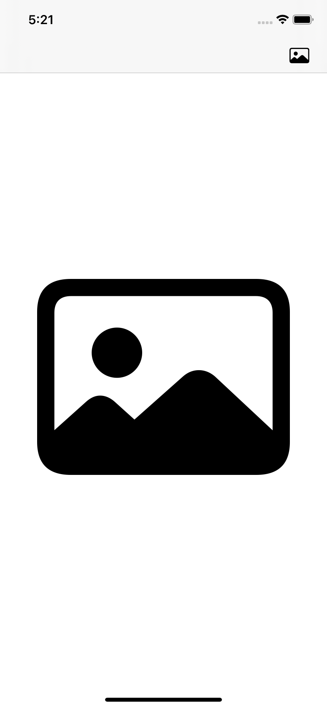
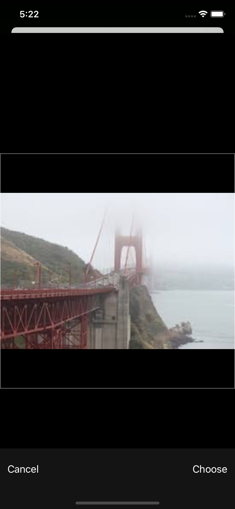
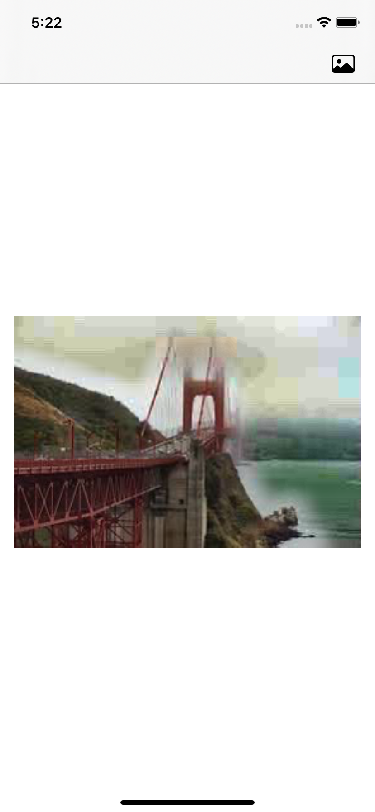

# MoiraDehazer

Dark Channel Prior Dehazing implementation for IOS using Swift 5

I started this solution as a personal project to apply the acquired knowldge gathered from swift programming courses.
This project is based on a more complex solution made in C++ which is my language of choise.

The project is very simple, consists of an image picker and an image view, the idea is to select a hazy mage from the  galery, then apply a dehaze algorithm based on the Dark Channel Prior described in the paper "Single Image Haze Removal Using Dark Channel Prior" by "Kaiming He, Jian Sun and Xiaoou Tang". There is a lot of papers that can be found on the internet that could serve as gudiance aside the one mentioned if more in-depth detail is required.

Solution was made in Xcode 12 for IOS 14.4 and was primarily written in Swift 5.
Soft matting library libSoftMatting.dylib is a shared library that I developed to apply a soft matting process to a  previously generated transmission map, the library was developed in C++, library and header/bridge(s) are provided, altough the library provided is for simulator only. Feel free to ask for a device version. 

